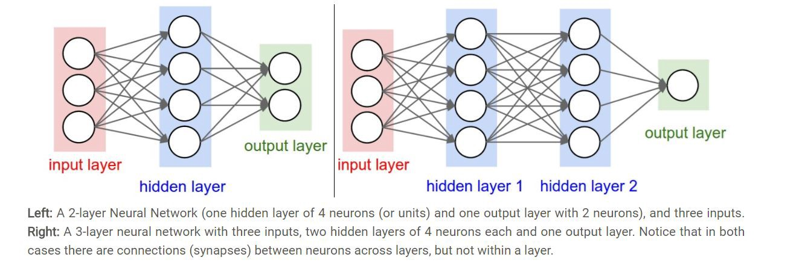

<html>
<head>

</head>
<body>

<ul>
  <li><a class="active">Home</a></li>
  <li><a href="mlp_r_mxnet.html">R</a></li>
  <li><a href="python_tf.html">Python Tensorflow</a></li>
  <li><a href="mlp_python_base.html">Python Base</a></li>
</ul>

</body>
</html>
***
***
***

##***Multi-Layer Perceptron***

### Course group(18) project of Stats 506 at University of Michigan in term Fall 2018-***Ming Gao ***  ***Zhe Yin ***  ***Zizhao Zhang***

## General:
Neural Network (NN) is no doubt the most interesting and challenging machine learning algorithm. Among NNs, Multi-Layer Perceptron (MLP) is an easy and useful one. In this project we will introduce some most common and well-established frameworks to achieve MLP: R::mxnet (supported by Amazon Web Services (AWS)), Python::tensorflow (developed by Google Brain) and we will realize two-layer NN in basic Python.

The aim of this project is to let you not be afraid of NN and feel that NN is not fancy and magic. Actually, all the mathematics needed in MLP is just matrix multiplication and gradient of matrix.

Indeed! MLP is just a little more complex than linear regression and logistic regression. Actually, linear regression is 0 hidden layer MLP with linear activation output while logistic regression is 0 hidden layer MLP with sigmoid activation output. Since 0 layer has little strength, we can construct many layers and since linear activation doesn't work well, we can use some other activated functions (especially RELU).

We have already constructed the architecture of MLP! The LOSS function is nothing special than what we use in simple model. We use MSE for numerical output, sigmoid in binary output and multi-sigmoid (softmax) in multivariate output (the same as multi-logistic regression).

After we get the LOSS, we begin to update the coefficients (weights). How to do it? We can get accurate answer in linear regression and we use Iterative Reweighted Least Squares (IRLS) in logistic regression. We can find that IRLS is nothing fancy than Newton method. Here in MLP we use gradient descent to update weights (because of speed).

Quoted from Dr. Henderson:

> It¡¯s also not quite accurate to describe fitting a neural network to be as simple as IRLS/Newton Rapshon.  These algorithms work and generally find a global optimum because classical regression techniques (using MLE) have convex loss functions.  This is not the case in a neural net and is one of the reasons we need multiple learning epochs.

I am sorry for the inaccuracy. The objective function in MLP is not convex thus there is no guarantee that it will converge or not. In application, we simply use stochastic gradient descent method (SGD, using a batch of samples each time) to save running time. In some situations, we can use advanced methods such as Adam Optimizer or RMSprop. We can think these optimizers as changing learning rate each time automatically.

It is not a big problem for non-convergence because we use oversized parameter and stochastic methods. See these quotes from the paper [CNN Gradient-Based Learning Applied to Document Recognition]:

> The fact that local minima do not seem to be a problem for MLP is somewhat of a theoretical mystery. It is conjectured that if the network is oversized for the task, the presence of extra dimensions in parameter space reduced the risk of unattainable regions.

That's it! We get all the whole important parts in MLP. Still confused? Never mind, please take a look at two-layer MLP in base Python and follow it line-by-line. Codes are usually more logical than words.

The above are just my own understanding of MLP and I don't want to copy and paste tedious definitions and concepts from Wiki or somewhere else. The detailed MLP may cost 1000 pages long. However, I will introduce some resources for you to get mathematical and standard formula in NN.

I *strongly* recommend you to an online course: stanford cs231n (Convolutional Neural Networks for Visual Recognition). The reasons are below: 1. classical (stanford, instructor: Fei-Fei Li) 2. comprehensive (MLP, CNN, RNN, beyond...) 3. friendly for beginner (detailed slides, vedios, coursera courses) 4. great homework (several homework including realizing a NN by ourselves in basic Python) 5. resourceful (have been translated in many languages and many relevent materials in github) 6. and so on...

Also, we can use some built platform to achieve more advanced NN structures. However, importantly, we should make sure that the code indeed realizes what we want. The learning curve is steep but it deserves. One annoying thing is that there are so many versions of tensorflow and it is updated very fast (especially tensorflow API 2.0 will change a lot next year), so maybe some of the functions are deprecated. Please check API before implementing any functions.

## Algorithm description: 

A multilayer perceptron (MLP) is a feedforward artificial neural network model that has one layer or more of hidden units and nonlinear activations. In fact, Multilayer perceptron is really a misnomer, because rather than containing multiple perceptrons (with discontinuous nonlinear activations), the model comprises multiple layers of logistic regression models (with continuous nonlinearities). Instead of feeding the input to the logistic regression, in a MLP you insert a intermediate layer (the hidden layer) that has a nonlinear activation function (such as tanh or sigmoid). One can make the architecture deep by inserting many such hidden layers.
Here is an example of its basic structure (from cs231n.standford.edu):

## Dataset & Description: 

We chose to implement our simulation of the topic using an open-source dataset from the Kaggle dataset. The link is provided as following:https://www.kaggle.com/blastchar/telco-customer-churn.
The dataset can downloaded using the following command running: "kaggle datasets download -d blastchar/telco-customer-churn" The dataset we chosen is a compliation of datas and metadatas of the subscription status of the telecommunication industry, with 7043 rows (customers) and 21 columns (features), with "Churn" as our target response of the process. Each row represents a customer with CustomerID as the first column within each row, each column contains customer’s attributes described on the column Metadata. For more information of the features of the data, please read below

1st Column: customerID - Customer ID 

***
2nd Column: gender - Customer gender (female, male) 

***
3rd Column: SeniorCitizen - Whether the customer is a senior citizen or not (1, 0)

***
4th Column: Partner - Whether the customer has a partner or not (Yes, No) 

***
5th Column: Dependents - Whether the customer has dependents or not (Yes, No) 

***
6th Column: tenure - Number of months the customer has stayed with the company 

***
7th Column: PhoneService - Whether the customer has a phone service or not (Yes, No) 

***
8th Column: MultipleLines - Whether the customer has multiple lines or not (Yes, No, No phone
service) 

***
9th Column: InternetService - Customer internet service provider (DSL, Fiber optic, No)

***
10th Column: OnlineBackup - Whether the customer has online backup or not (Yes, No, No internet service)

***
11th Column: DeviceProtection - Whether the customer has device protection or not (Yes, No, No internet service) 

***
12th Column: TechSupport - Whether the customer has tech support or not (Yes, No, No internet service)

***
13th Column: StreamingTV - Whether the customer has streaming TV or not (Yes, No, No internet service) 

***
14th Column: StreamingMovies - Whether the customer has streaming movies or not (Yes, No, No internet service) 

***
15th Column: Contract - The contract term of the customer (Month-to-month, One year, Two year)

***
16th Column: PaperlessBilling - Whether the customer has paperless billing or not (Yes, No)

***
17th Column: PaymentMethod - The customer payment method (Electronic check, Mailed check, Bank transfer (automatic), Credit card (automatic)) 

***
18th Column: MonthlyCharges - The amount charged to the customer monthly 

***
19th Column: TotalCharges - The total amount charged to the customer

## What's new compared with last year:

We talked about the architecture and some main concepts in MLP (LOSS, back-propagate) and we give an inspiring and exciting implement using base Python with just 100 lines of code (which is understandable I think). As we skimmed through last year¡¯s project, we indeed were able to grasp the essential idea of MLP, and were inspired by their contents. I hope, after reading our project, you may fell that MLP is easy and nothing difficult than linear model:)

Last year they use R::neuralnet and Python::sklearn.neural\_network.MLPClassifier to realize MLP. However we introduce tensorflow and MXNet, which are no doubt more advanced and well-established. I think we should use the most popular platform not only because they are more stable but also they have bigger community which are pivot for us learners.

Last year, they use total dataset (Boston) to set max and min for scaling and apply them to both train and test dataset. In my opinion, it may allow information leakage if we use information in test dataset when scaling training dataset. What a more common procedure is that we scale train dataset as usual and use the same scaling parameters to test dataset.

## Things to consider when following along the way:

Noticed that the resulted accuracy of three simulations by three difference implementations vary in differences: The accuracries of predictions rendered by both MXNET and base-Python are close to 80 %. Unfortunately, since the tools of implementing the code of Python tensorflow causes a minor difference of accuracy as tensorflow was using annaconda jupyter notebook, the final accuracy was around 75 %. The uncongurunity of the accuracy can be caused by such factors as batch size, which we decided as 40. However, since the dataset size is 7043*21 before data cleaning, manveuring and caliberating around the batch size won't render much in improvement of the accuracy. The scaler of data we chose is using MINMAX method, while adjusting the scaling method may improve the accuracy as well. 

## References for groups:

###***references-for R-MXNET: ***

mxnet reference manual: https://s3.amazonaws.com/mxnet-prod/docs/R/mxnet-r-reference-manual.pdf

mxnet introduction page: https://www.cs.cmu.edu/~muli/file/mxnet-learning-sys.pdf

standford cs231n assignment reference: http://cs231n.github.io/assignments2018/assignment1/

###***references-for Python-base: ***
instruction on implement the two-layer-MLP: http://cs231n.stanford.edu/

general consensus of netural network: http://neuralnetworksanddeeplearning.com/

###***references-for Python-tensorflow: ***

tutorial on python tensordflow: https://www.youtube.com/watch?v=yX8KuPZCAMo

API for python tensorflow: https://www.tensorflow.org/api_docs/

Tensorflow for two layer-network: https://www.easy-tensorflow.com/tf-tutorials/neural-networks/two-layer-neural-network?view=article&id=124:two-layer-neural-network