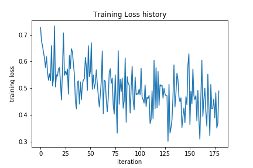

```{r setup, include=FALSE}
knitr::opts_chunk$set(echo = TRUE)
```

## Description | <a href="introduction.html">Home</a>

Implementing NN totally in base Python is really hard for me, but it is meaningful and will help us understand how exactly NN runs rather than using some pre-coded frameworks and regarding it as a black box.

In this project, I will realize a two layer NN (one hidden layer and one output layer) with RELU in hidden layer and softmax in output layer. Even I have done such simplify, It is still hard for me. However, thanks to many open courses, in the slides of cs231n, it gives us all the detailed algorithms for implementing NN and in the first homework it gives us a chance to realize two layer NN with some hints. See <http://cs231n.github.io/assignments2018/assignment1/>. The main structure is given but many of the codes are blank and you can fill in yourselves or take a look at my solution and some others in github.

Here, we construct a Python Class: `TwoLayerNet` to realize two layer NN.

In each time, we compute the LOSS and update our weights by gradient decent method. So main parts of NN is to understand forward part (how to compute LOSS) and backpropagate part (how to compute gradient of weights).

Because we consider two layer NN here, there are totally two W and two bias.

First, we determine the matrix dimension. It is useful to match dimensions everywhere in our implementation.


* X (N*D) is the input. N stands for N samples (batches). D is the number of features.
* W1 (D*H) is the first weight matrix. H is the number of hidden nodes.
* b1 (1*H) is the first bias vector.
* W2 (H*C) is the second weight matrix. C is the number of output (for the example, C=2 binary output).
* b2 (1*C) is the second bias vector.


Then we define some intermediate matrix for simplicity.

* $h=X*W1.+b1$ (N*H). "." means the operator is column-wise.
* $h\_output=f.(h)$ (N*H), where f() is RELU function. "." means it is element-wise.
* $scores=h\_output*W2.+b2$ (N*C).
* $softmax\_output[i,:]=softmax(scores[i,:])$. softmax() is the softmax function. softmax_output (N*C).
* $LOSS=sum(log(softmax\_output[:,y]))$ (1*1).

The above is the forward pass. We finally get the LOSS value.

Then we do the backpropagate part. It is nothing special than chain rule of gradient. But there is a point we need to remember, here we use gradient of matrix rather than ordinary gradient of scalar. We can use matrix compliance to achieve that.


* $dscore=\frac{\partial LOSS}{\partial scores}$ (N*C).
* $gradient[W2]=\frac{\partial LOSS}{\partial W2}=h\_output^T*dscore$ (H*C).
* $dh\_output=dscore*W2^T$ (N*H).
* $dh=dh\_output .* \frac{\partial f(x)}{\partial x}=dh\_output .* (h\_output>0)$ (N*H). Here "." means element-wise.
* $gradient[W1]=X^Tdh$ (D*H).


Finally, we get the gradients of all the weights and bias. Then we can update them and train them for several times.

The main thought has been stated above. I apologize if you are still a little confused. Hope my code below will give you a much clearer understanding (all the formulas above have their counterpoints with same name in the code). Also please take a look at cs231n course and original paper about MLP.

## TwoLayerNet Class

We follow what we have stated before to construct the python class.

```{python}
import numpy as np

class TwoLayerNet(object):
  """
  A two-layer fully-connected neural network. The net has an input dimension of
  N, a hidden layer dimension of H, and performs classification over C classes.
  We train the network with a softmax loss function and L2 regularization on the
  weight matrices. The network uses a ReLU nonlinearity after the first fully
  connected layer.

  In other words, the network has the following architecture:

  input - fully connected layer - ReLU - fully connected layer - softmax

  The outputs of the second fully-connected layer are the scores for each class.
  """

  def __init__(self, input_size, hidden_size, output_size, std=1e-4):
    """
    Initialize the model. Weights are initialized to small random values and
    biases are initialized to zero. Weights and biases are stored in the
    variable self.params, which is a dictionary with the following keys:

    W1: First layer weights; has shape (D, H)
    b1: First layer biases; has shape (H,)
    W2: Second layer weights; has shape (H, C)
    b2: Second layer biases; has shape (C,)

    Inputs:
    - input_size: The dimension D of the input data.
    - hidden_size: The number of neurons H in the hidden layer.
    - output_size: The number of classes C.
    """
    self.params = {}
    self.params['W1'] = std * np.random.randn(input_size, hidden_size)
    self.params['b1'] = np.zeros(hidden_size)
    self.params['W2'] = std * np.random.randn(hidden_size, output_size)
    self.params['b2'] = np.zeros(output_size)

  def loss(self, X, y=None, reg=0.0):
    """
    Compute the loss and gradients for a two layer fully connected neural
    network.

    Inputs:
    - X: Input data of shape (N, D). Each X[i] is a training sample.
    - y: Vector of training labels. y[i] is the label for X[i], and each y[i] is
      an integer in the range 0 <= y[i] < C. This parameter is optional; if it
      is not passed then we only return scores, and if it is passed then we
      instead return the loss and gradients.
    - reg: Regularization strength.

    Returns:
    If y is None, return a matrix scores of shape (N, C) where scores[i, c] is
    the score for class c on input X[i].

    If y is not None, instead return a tuple of:
    - loss: Loss (data loss and regularization loss) for this batch of training
      samples.
    - grads: Dictionary mapping parameter names to gradients of those parameters
      with respect to the loss function; has the same keys as self.params.
    """
    # Unpack variables from the params dictionary
    W1, b1 = self.params['W1'], self.params['b1']
    W2, b2 = self.params['W2'], self.params['b2']
    N, D = X.shape

    # Compute the forward pass
    scores = None
    #############################################################################
    # TODO: Perform the forward pass, computing the class scores for the input. #
    # Store the result in the scores variable, which should be an array of      #
    # shape (N, C).                                                             #
    #############################################################################
    h_output = np.maximum(0, X.dot(W1) + b1) #(N,D) * (D,H) = (N,H)
    scores = h_output.dot(W2) + b2
    # pass
    #############################################################################
    #                              END OF YOUR CODE                             #
    #############################################################################
    
    # If the targets are not given then jump out, we're done
    if y is None:
      return scores

    # Compute the loss
    loss = None
    #############################################################################
    # TODO: Finish the forward pass, and compute the loss. This should include  #
    # both the data loss and L2 regularization for W1 and W2. Store the result  #
    # in the variable loss, which should be a scalar. Use the Softmax           #
    # classifier loss. So that your results match ours, multiply the            #
    # regularization loss by 0.5                                                #
    #############################################################################
    shift_scores = scores - np.max(scores, axis = 1).reshape(-1,1)
    softmax_output = np.exp(shift_scores)/np.sum(np.exp(shift_scores), axis = 1).reshape(-1,1)
    loss = -np.sum(np.log(softmax_output[range(N), list(y)]))
    loss /= N
    loss +=  0.5* reg * (np.sum(W1 * W1) + np.sum(W2 * W2))
    # pass
    #############################################################################
    #                              END OF YOUR CODE                             #
    #############################################################################

    # Backward pass: compute gradients
    grads = {}
    #############################################################################
    # TODO: Compute the backward pass, computing the derivatives of the weights #
    # and biases. Store the results in the grads dictionary. For example,       #
    # grads['W1'] should store the gradient on W1, and be a matrix of same size #
    #############################################################################
    # pass
    dscores = softmax_output.copy()
    dscores[range(N), list(y)] -= 1
    dscores /= N
    grads['W2'] = h_output.T.dot(dscores) + reg * W2
    grads['b2'] = np.sum(dscores, axis = 0)
    
    dh_output = dscores.dot(W2.T)
    dh = (h_output > 0) * dh_output
    grads['W1'] = X.T.dot(dh) + reg * W1
    grads['b1'] = np.sum(dh, axis = 0)
    
    #############################################################################
    #                              END OF YOUR CODE                             #
    #############################################################################

    return loss, grads

  def train(self, X, y, 
            learning_rate=1e-3, learning_rate_decay=0.95,
            reg=1e-5, num_iters=100,
            batch_size=200, verbose=False):
    """
    Train this neural network using stochastic gradient descent.

    Inputs:
    - X: A numpy array of shape (N, D) giving training data.
    - y: A numpy array f shape (N,) giving training labels; y[i] = c means that
      X[i] has label c, where 0 <= c < C.
    - learning_rate: Scalar giving learning rate for optimization.
    - learning_rate_decay: Scalar giving factor used to decay the learning rate
      after each epoch.
    - reg: Scalar giving regularization strength.
    - num_iters: Number of steps to take when optimizing.
    - batch_size: Number of training examples to use per step.
    - verbose: boolean; if true print progress during optimization.
    """
    num_train = X.shape[0]
    iterations_per_epoch = max(num_train / batch_size, 1)

    # Use SGD to optimize the parameters in self.model
    loss_history = []
    train_acc_history = []

    for it in range(num_iters):
      X_batch = None
      y_batch = None

      #########################################################################
      # TODO: Create a random minibatch of training data and labels, storing  #
      # them in X_batch and y_batch respectively.                             #
      #########################################################################
      idx = np.random.choice(num_train, batch_size, replace=True)
      X_batch = X[idx]
      y_batch = y[idx]
      # pass
      #########################################################################
      #                             END OF YOUR CODE                          #
      #########################################################################

      # Compute loss and gradients using the current minibatch
      loss, grads = self.loss(X_batch, y=y_batch, reg=reg)
      loss_history.append(loss)

      #########################################################################
      # TODO: Use the gradients in the grads dictionary to update the         #
      # parameters of the network (stored in the dictionary self.params)      #
      # using stochastic gradient descent. You'll need to use the gradients   #
      # stored in the grads dictionary defined above.                         #
      #########################################################################
      self.params['W2'] += - learning_rate * grads['W2']
      self.params['b2'] += - learning_rate * grads['b2']
      self.params['W1'] += - learning_rate * grads['W1']
      self.params['b1'] += - learning_rate * grads['b1']
      # pass
      #########################################################################
      #                             END OF YOUR CODE                          #
      #########################################################################

      if verbose and it % 100 == 0:
        print('iteration %d / %d: loss %f' % (it, num_iters, loss))

      # Every epoch, check train and val accuracy and decay learning rate.
      if it % iterations_per_epoch == 0:
        # Check accuracy
        train_acc = (self.predict(X_batch) == y_batch).mean()
        train_acc_history.append(train_acc)

        # Decay learning rate
        learning_rate *= learning_rate_decay

    return {
      'loss_history': loss_history,
      'train_acc_history': train_acc_history,
    }

  def predict(self, X):
    """
    Use the trained weights of this two-layer network to predict labels for
    data points. For each data point we predict scores for each of the C
    classes, and assign each data point to the class with the highest score.

    Inputs:
    - X: A numpy array of shape (N, D) giving N D-dimensional data points to
      classify.

    Returns:
    - y_pred: A numpy array of shape (N,) giving predicted labels for each of
      the elements of X. For all i, y_pred[i] = c means that X[i] is predicted
      to have class c, where 0 <= c < C.
    """
    y_pred = None

    ###########################################################################
    # TODO: Implement this function; it should be VERY simple!                #
    ###########################################################################
    h = np.maximum(0, X.dot(self.params['W1']) + self.params['b1'])
    scores = h.dot(self.params['W2']) + self.params['b2']
    y_pred = np.argmax(scores, axis=1)
    # pass
    ###########################################################################
    #                              END OF YOUR CODE                           #
    ###########################################################################

    return y_pred

```

## MLP

First we import the dataset and do some data cleaning.

```{python}
import numpy as np
import pandas as pd
from sklearn.model_selection import train_test_split
import matplotlib.pyplot as plt
from sklearn import preprocessing


data=pd.read_csv('./WA_Fn-UseC_-Telco-Customer-Churn.csv')
X=data.iloc[:,:20].astype('category')
for i in range(X.shape[1]):
    X.iloc[:,i]=X.iloc[:,i].cat.codes
    
y=data.iloc[:,-1].astype('category').cat.codes

input_size=X.shape[1]
hidden_size=20
num_classes=2

#np.random.seed(0)
traind, testd, trainy, testy = train_test_split(X, y, train_size=0.75)

traindd=traind.values; testdd=testd.values
trainyy=trainy.values; testyy=testy.values

data_scaler = preprocessing.MinMaxScaler()
traindd = data_scaler.fit_transform(traindd) ; testdd = data_scaler.fit_transform(testdd)

#display
print(traindd[:5,])
print(trainyy[:5,])
```

Then we can simply use this class the train our model.

```{python}
#np.random.seed(0)
net=TwoLayerNet(input_size, hidden_size, num_classes, std=1e-1)
stats = net.train(traindd, trainyy, 
                  learning_rate=1e-1, reg=5e-6,
                  num_iters=180, batch_size=40, verbose=False)

print('Final training loss: ', stats['loss_history'][-1])
print('Accuracy of test data:', np.mean(net.predict(testdd)==testyy))
```

Also we can show the training loss figure.
```{r , eval = FALSE}
# plot the loss history
plt.plot(stats['loss_history'])
plt.xlabel('iteration')
plt.ylabel('training loss')
plt.title('Training Loss history')
plt.savefig("trainloss.png")
plt.show()
```

```{r fig_9, echo=FALSE, out.width = "500px",fig.cap = "classification report", fig.align = 'center'}

```